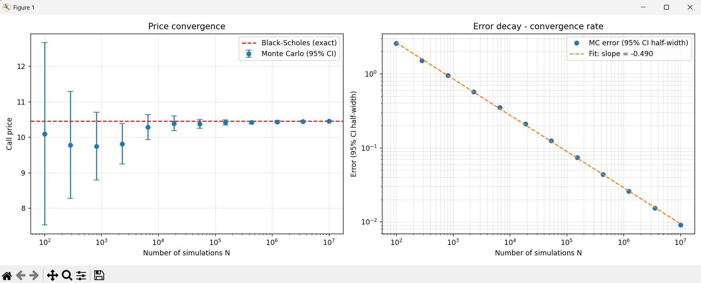

# Monte Carlo Pricing of a European Call Option

A Monte Carlo pricer for European call options, **validated against the closed-form
Black–Scholes price** and used to measure the theoretical **1/√N convergence rate**
of the Monte Carlo error empirically.

## Overview

The project does three things:

1. Prices a European call by Monte Carlo simulation under the risk-neutral measure.
2. Cross-checks the result against the closed-form Black–Scholes formula.
3. Measures the convergence rate of the Monte Carlo error via a log–log regression,
   recovering the expected exponent of −1/2.

## Theory in brief

**Risk-neutral valuation.** By no-arbitrage, the price of a European call is the
discounted expectation of its payoff under the risk-neutral measure *Q*:

$$C = e^{-rT}\,\mathbb{E}^{Q}\big[\max(S_T - K,\,0)\big]$$

Under *Q*, the underlying follows a geometric Brownian motion whose terminal value
has a **closed-form solution** — so for a European payoff (which depends only on the
terminal price) no path simulation is needed, a single draw per trajectory suffices:

$$S_T = S_0 \exp\\Big(\big(r - \tfrac{1}{2}\sigma^2\big)T + \sigma\sqrt{T}\,Z\Big),
\qquad Z \sim \mathcal{N}(0,1)$$

**Monte Carlo estimate and error.** The price is the mean of the discounted payoffs
over *N* simulations. Because it is a sample mean, its uncertainty is quantified by the
standard error, and the 95% confidence interval is `price ± 1.96 · SE`:

$$\mathrm{SE} = \frac{\hat{\sigma}_Y}{\sqrt{N}}$$

**Convergence rate.** The 1/√N dependence means the error decays as a power law of
exponent −1/2. Plotting the error against *N* in log–log scale turns this into a
straight line whose slope is measured by linear regression.

## Results

With `S0 = K = 100`, `r = 0.05`, `σ = 0.20`, `T = 1`:

| Method | Price |
|---|---|
| Monte Carlo (N = 10⁶) | 10.43 ± 0.03 (95% CI) |
| Black–Scholes (exact) | 10.4506 |

The Monte Carlo estimate agrees with the closed-form price within the confidence
interval, and the measured convergence slope is **≈ −0.49**, matching the theoretical
−0.5.



*Left: the Monte Carlo price with 95% confidence intervals converging to the
Black–Scholes value as N grows. Right: the error decay in log–log scale, with the
fitted slope confirming the 1/√N rate.*

## Usage

```bash
pip install -r requirements.txt
python Pricing_GitHub_project.py
```

This prints the Monte Carlo vs Black–Scholes sanity check and saves the convergence
figure to `convergence.png`.

## Files

| File | Description |
|---|---|
| `Monte_Carlo_Pricing_GitHub_project.py` | Pricing functions, Black–Scholes check, and convergence study |
| `requirements.txt` | Python dependencies |
| `convergence.png` | Generated convergence figure |

## Requirements

Python 3.9+ with `numpy`, `scipy`, and `matplotlib`.

